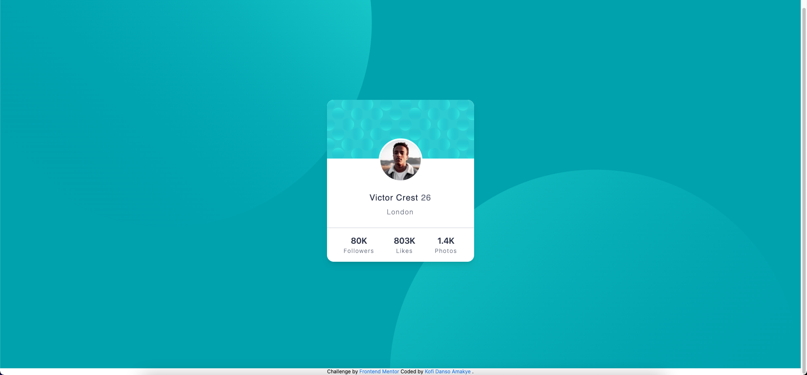

# Frontend Mentor - Profile card component solution

This is a solution to the [Profile card component challenge on Frontend Mentor](https://www.frontendmentor.io/challenges/profile-card-component-cfArpWshJ). Frontend Mentor challenges help you improve your coding skills by building realistic projects. 

## Table of contents

- [Overview](#overview)
  - [Screenshot](#screenshot)
  - [Links](#links)
- [My process](#my-process)
  - [Built with](#built-with)
- [Author](#author)
- [Acknowledgments](#acknowledgments)

## Overview

### Screenshot



### Links

- Solution URL: [(https://github.com/Kofiastro/Product-preview-card-component)]
- Live Site URL:[(https://creative-pothos-4005de.netlify.app/)]

## My process
Using Tailwindcss i have been able to work on designs much faster and i want to learn more by working on more projects at frontendmentor to help me be good at it.

### Built with

- TailwindCss

### What I learned

Fith Project using TailwindCSS.So far so good.I was faced with one big issue relating to the background images.Since i had to add  two images it was difficult setting up it using tailwindcss.But i am glad i was able to figure it out as always.The code below was one important key thing i was able to identify regarding background images.I used arbituary method and set each tag with a background image since adding two images in one main tag was not working.I went ahead and set meda breakpoints for each display.The code snippet below shows the html and tailwind.config file making my background images a success.

```html
<!--Background images using two Svg's and setting each display on media breakpoints-->
          <body class="bg-Dark_cyan ">
  <main class=" bg-BackTop bg-no-repeat bg-[position:120%_700%] md:bg-BackTop md:bg-[position:-10%_500%]  " >
    <!--main container-->
    <div class="flex items-center justify-center h-screen  bg-BackBottom bg-[position:-40%_-500%] md:BackBottom md:bg-[position:100%_-500%] bg-no-repeat " >
```
```js
/** @type {import('tailwindcss').Config} */
module.exports = {
  content: ['./*.html'],
  theme: {
    extend: {
      backgroundImage:{
        BackTop:"url('../images/bg-pattern-top.svg')",
        BackBottom:"url('../images/bg-pattern-bottom.svg')"
      },
    },
  },
  plugins: [],
}
```
## Author

- Frontend Mentor - [@Kofiastro](https://www.frontendmentor.io/profile/kofiastro)

## Acknowledgments

Big thanks to Traversy Media and the frontendmentor team 🎉
